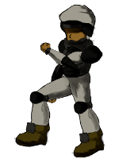

# Shooter Gym
The Shooter Gym implements OpenAI gym for building a reinforcement learning agent playing a 2D shooter game.


## Setup 
Downloading all the necessary libraries: 
```
pip install -r requirements.txt
```

In the Linux environment, you might have to install OpenGL to render the visualization.
```
apt-get install -y python3-opengl
```

## Training
Q-learning:
```
python3 train.py
```

Deep Q-learning:
```
python3 dqn_train.py
```

## Environment 
In the game, players try to control the soldier to shoot the enemies while trying to survive as long as possible. 

### Soldier 




Move using 'W': upwards, 'A': left, 'S': downwards, 'D': right and keep firing bullets automatically 

### Enemies


The soldier is dead upon touching the enemies 

### State space 
The observation space in the Q-learning phrase is pretty simple. The soldier would be able to check if enemies exist at 8 angle intervals. 

